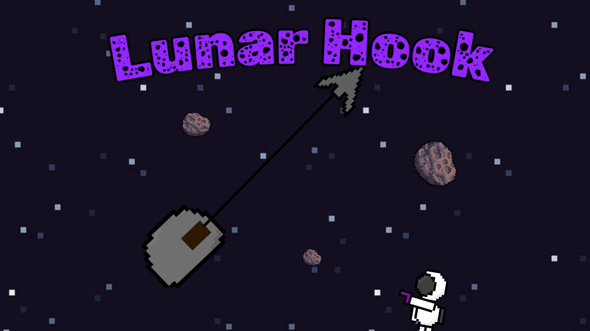

A physics-based bullet hell game centered around a grappling hook mechanic on the moon.

I made this game long before learning about git version control and general programming best practices and only added it to github much later to have all my significant projects in one place, so please forgive the embarrassing lack of good practice.

I did however learn about the following things while making this game for fun:

* singletons
* coroutines
* game design including sprite design, animation, a more thorough undertanding of copyright law and teh various aspects of Unity
* Practice thinking logicaly for the more complex parts such as making the grappling hook work in 3 different ways and adjusting the physics accordingly
* Practice using the debugger
